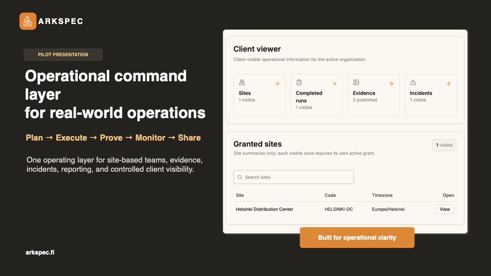
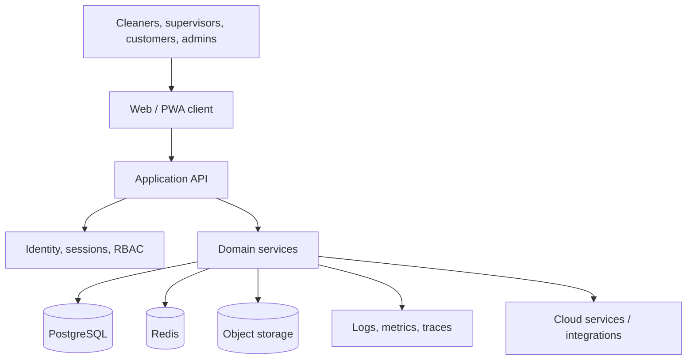

# ArkSpec

**Operational command layer for site-based service teams.**

**Plan -> Execute -> Prove -> Monitor -> Share**

ArkSpec is a cloud-native SaaS platform for cleaning and facility service operations. It connects operational execution, proof of work, incident handling, reporting, and controlled customer visibility.

> This repository is a public engineering case study.
> The production source code, customer data, infrastructure, and secrets remain private.

[Product -> arkspec.fi](https://arkspec.fi)



_Preview image exported from the public pilot presentation. The visible data is demo/sanitized data._

## Case Study At A Glance

| Area | Summary |
| --- | --- |
| Product | SaaS operating layer for cleaning and facility service operations |
| Users | Cleaners, supervisors, operations managers, customer viewers, platform admins |
| Core value | Turn distributed site work into verifiable, traceable, customer-visible operations |
| Repository type | Public engineering case study; production implementation remains private |
| My role | Product owner, architect, full-stack engineer, and production operator |
| Public materials | English and Finnish pilot/prospect presentations, sanitized visual overview |

## The Problem

Cleaning and facility service work is highly distributed. Work happens across many customer sites, often outside normal office hours, while supervisors and customers still need reliable visibility into what was completed, what changed, and what needs follow-up.

Without a shared system, reporting often depends on messages, spreadsheets, manual checks, and fragmented operational tools. ArkSpec is designed to make that work structured, verifiable, and easier to operate.

## My Role

I am building ArkSpec end to end, covering product decisions, software architecture, implementation, deployment, and production operation.

My responsibilities include:

- translating operational requirements into product and system architecture
- building frontend workflows for operational and customer-facing users
- designing backend APIs, domain services, validation, and authorization boundaries
- modelling relational operational data with PostgreSQL and Prisma
- implementing identity, session, role, permission, and organization-scope behavior
- preparing deterministic demo and pilot data for customer conversations
- managing deployment, environment configuration, monitoring, and release work
- supporting pilot/customer onboarding and turning feedback into product decisions

This combination matters because engineering decisions are tested against real operational usage, not only isolated feature requirements.

## Engineering Scope

The private implementation is a TypeScript monorepo with a React frontend and Node.js backend.

- **Frontend:** React, Vite, TypeScript, Tailwind CSS, shadcn/ui, TanStack Query, React Router
- **Backend:** Node.js, Express, TypeScript, modular REST API, middleware-based authorization
- **Data:** PostgreSQL, Prisma, JSONB where useful, Redis, object storage for evidence/files
- **Security:** session handling, CSRF protection, role-based permissions, organization-scoped access
- **Operations:** Docker-based local stack, CI/CD workflows, migrations, seed scripts, demo reset flow
- **Reliability:** health checks, audit trails, structured operational boundaries, production-ready deployment thinking

Core product domains include identity and access, organization structure, operational teams, process definition, execution, incidents, reporting, and audit.

## Architecture



This diagram is intentionally simplified. Production infrastructure details are omitted from the public repository.

## Selected Engineering Decisions

### Contextual authorization

ArkSpec does not treat visibility as a frontend concern. Org Admins, Supervisors, Workers, and Client Viewers receive different authorized projections of the same operational domain.

### Versioned operational processes

Published process versions remain stable for active execution while future changes can be prepared independently.

### Offline-capable field workflows

Previously loaded worker tasks can continue through temporary connectivity loss, with queued changes validated against normal server-side authorization and conflict rules after reconnection.

### Customer-safe publication

Internal operational records are not exposed directly to customers. Customer visibility is explicitly granted, and only selected records are published through customer-safe projections.

## Product Screens / Demo

Current public visual:

- [Pilot overview preview](docs/screenshots/arkspec-pilot-overview.png)

Good next additions for this case study would be sanitized screenshots of:

- site/customer overview
- cleaning proof workflow
- supervisor or operations dashboard
- customer visibility view
- mobile field-worker flow

Before adding screenshots, remove or replace real customer names, employee names, addresses, UUIDs, account identifiers, API URLs, QR codes, tokens, and production-only infrastructure details.

## Public Presentations

- [Pilot / Prospect Presentation - English v6.1](docs/presentations/arkspec-pilot-prospect-presentation-v6.1.pdf)
- [Pilotti- / prospektiesitys - Finnish v6.1](docs/presentations/arkspec-pilot-prospect-presentation-fi-v6.1.pdf)

These decks explain the product and business use case. The README keeps the engineering narrative primary, while the presentations provide supporting product context.

## Private / Public Boundary

ArkSpec is a real product with private implementation details. This repository exists to make the engineering work legible without exposing proprietary code, customer information, operational secrets, or sensitive infrastructure details.

This public case study does not include:

- production source code
- database dumps or customer data
- credentials, tokens, or environment files
- private infrastructure definitions
- production observability links or account identifiers
- implementation details that would weaken security or customer confidentiality

## Repository Structure

```text
arkspec-case-study/
|-- README.md
`-- docs/
    |-- presentations/
    |   |-- arkspec-pilot-prospect-presentation-v6.1.pdf
    |   `-- arkspec-pilot-prospect-presentation-fi-v6.1.pdf
    `-- screenshots/
        `-- arkspec-pilot-overview.png
```

## About Me

I am a Senior Full-Stack Software Engineer based in Oulu, Finland, with more than 15 years of professional software development experience.

I work on web applications, SaaS products, cloud systems, and end-to-end product engineering: from requirements and architecture through implementation, deployment, and production operation.

GitHub: [github.com/sveteok](https://github.com/sveteok)
